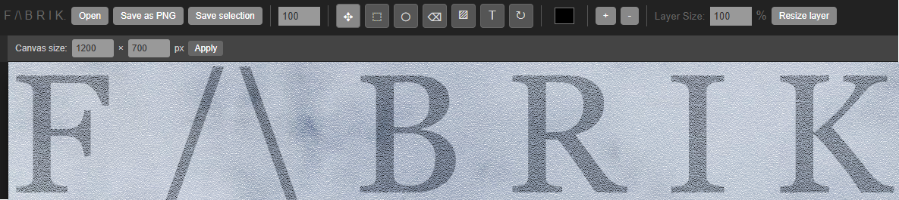

# Fabrik Imager

A minimalist photo editor to edit and create PNG images. Not the same as Gimp, Photoshop, Photopea, Canva or Paint, but rather unique as it has limited, but creative! functions, and is tailored to PNG files only. 

1000+ line code, makes it very portable. All images are exported with quality control, and are streamed as a blob to download. No server-side technology needed.

Has the most used functions, for simplicity:

Menu:

- Open/save PNG files. (also: save a selection)
- Drag/Pointer
- Resize a layer
- Rectangle
- Circles
- Fill/Bucket
- Color picker
- Zoom +/-
- Text
- Eraser
- Rotate layers (left mouse button to rotate)
- Filesize
- Various effects/filters
- Custom Fabrik Filters (folded paper, fine grain, rice paper, etc.)

Right menu:

Layers
- add layer
- delete layer
- merge layers
- dupe layer

Most popular shortcuts: ctrl+e to merge layers, crtl+c to copy layer, ctrl+v to paste, ctrl+x to cut a layer.

TIP: Use middle mouse button to drag layers, or items around
